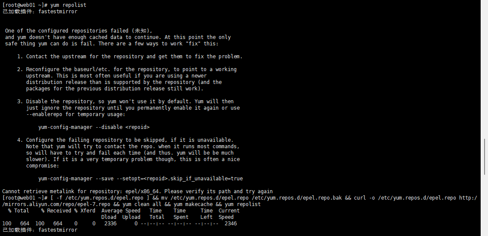

# Nginx

## 安装

使用 epel 源安装

```
# yum repolist 查看当前系统的yum仓库有哪些软件包
yum install epel-release -y # 安装yum扩展包
yum install nginx -y
```

安装完后通过 yum repolist 看扩展包数量是否报错，下图报错是因为网络问题，可以替换为国内镜像源


一键替换 EPEL 为阿里云源并刷新缓存

```
[ -f /etc/yum.repos.d/epel.repo ] && mv /etc/yum.repos.d/epel.repo /etc/yum.repos.d/epel.repo.bak && curl -o /etc/yum.repos.d/epel.repo http://mirrors.aliyun.com/repo/epel-7.repo && yum clean all && yum makecache && yum repolist

```

## 启动与关闭

```
#启动
systemctl start nginx

#查看是否启动了nginx进程
ps -ef|grep nginx

#关闭
systemctl enable nginx
```

启动后在浏览器中输入 IP:80 看是否能进入 nginx 页面，如果无法访问，虚拟机网络为NAT模式的情况下，可以在 VMware 中增加一个对 80 端口的网络转接

如果依旧无法通过浏览器访问，先通过其他电脑`ping IP`观察是否能ping成功，如果成功的话进行检查防火墙操作

在虚拟机执行：
```
firewall-cmd --list-all

# 如果 services 中没有 http，执行：

firewall-cmd --permanent --add-service=http
firewall-cmd --reload
```


nginx 默认占用 80 端口，可以使用`ss -lntup`查询端口占用情况

## 文件位置

**/etc/nginx/**

**nginx.conf**是主要配置文件

**nginx.conf.default**是初始配置文件

如果想恢复 nginx.conf 就是用 **>** 写入

```
grep -Ev '#|^$' nginx.conf.default > nginx.conf
```

## 配置文件说明

```
worker_processes  1;  # 进程数量
events {
    worker_connections  1024;
}
http {
    include       mime.types;
    default_type  application/octet-stream;
    sendfile        on;
    keepalive_timeout  65;
    server {
        listen       80;
        server_name  localhost;
        location / {
            root   html;
            index  index.html index.htm;
        }
        error_page   500 502 503 504  /50x.html;
        location = /50x.html {
            root   html;
        }
    }
}

```
