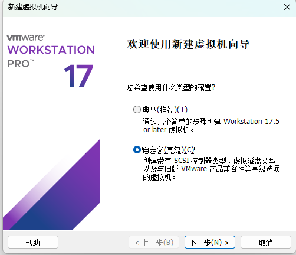
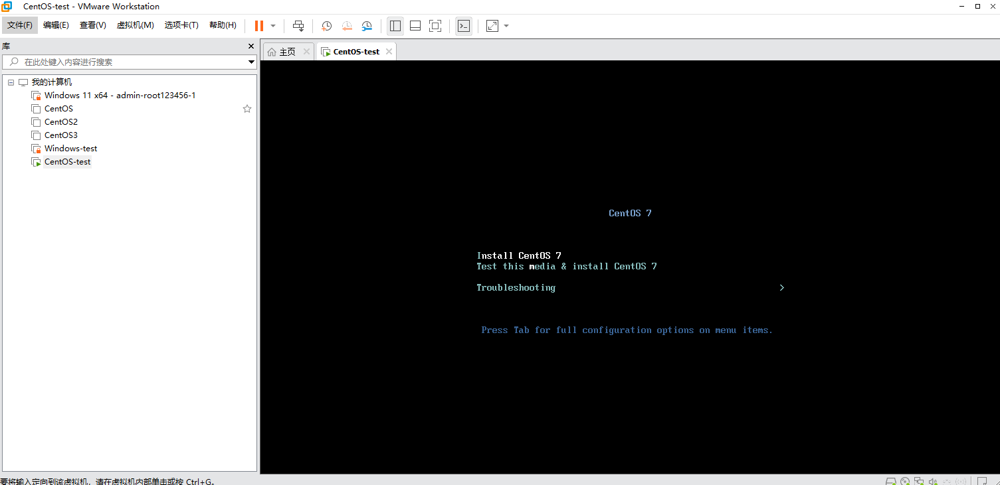

# 安装VMware并创建Windos、Linux虚拟机

## VMware Workstation pro
VMware Workstation pro（以下简称VMware）是一款开源用于创建虚拟机的软件，需要先注册登录BROADCOM，下载完安装包后直接默认安装

[VMware Workstation pro 17.6.4下载链接](https://support.broadcom.com/group/ecx/productfiles?subFamily=VMware%20Workstation%20Pro&displayGroup=VMware%20Workstation%20Pro%2017.0%20for%20Windows&release=17.6.4&os=&servicePk=533272&language=EN&freeDownloads=true)


也可使用Scoop进行安装，搜索 vmware-workstation-player-np 然后进行安装

```
scoop search vmware-workstation
scoop install vmware-workstation-player-np
```


## 创建Windows虚拟机
> 创建过程中没有提到的直接点击下一步，这里只说需要注意的地方

1.需要先在微软官网上去下载想要在虚拟机中使用的windows系统，注意这里需要下载ISO镜像文件

[windows 11 ISO镜像文件下载链接](https://www.microsoft.com/zh-cn/software-download/windows11)

2.在VMware主页中点击创建新的虚拟机，选择自定义



3.在这里选择刚才下载好的windows镜像文件


4.后面一直下一步至完成

5.点击完成后就会在软件中自动打开虚拟机并且已安装好window系统，之后在虚拟机中进行windows系统的相关配置就可以了


## 创建CentOS 7/Linux虚拟机
> 创建过程中没有提到的直接点击下一步，这里只说需要注意的地方

1.与windows相同，需要先下载一份CentOS Minimal(最小版本)的ISO镜像文件

[官网](https://vault.centos.org/7.0.1406/isos/x86_64/)

[国内阿里云镜像](https://mirrors.aliyun.com/centos/7.9.2009/isos/x86_64/?spm=a2c6h.25603864.0.0.1d25f5adURZyLq)


2.在VMware主页中点击创建新的虚拟机，选择自定义，将对应的iso文件传入进去然后下一步至完成

3.初始化Linux系统，选择第一个



4.稍等一会后会出现选择语言界面，根据需求选择，然后点击继续

5.弹出安装前配置选项，根据需求来进行调整，点击开始安装

6.在安装的过程中进行配置root密码与创建用户，root密码必须配置，用户可以不进行创建，然后等待安装完成即可

