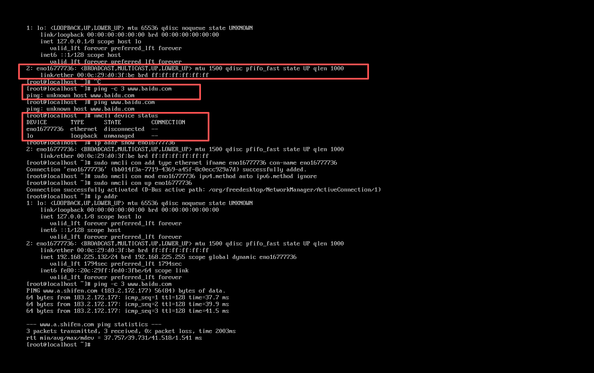
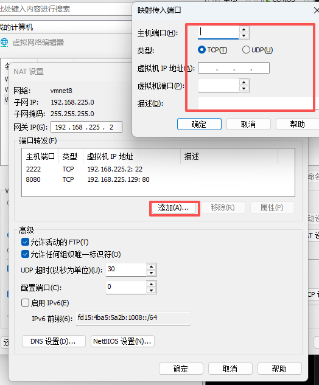

# Linux虚拟机常见问题

## 无法访问外网
> 使用`ping -c 3 www.baidu.con`如果没有返回结果就证明无法连接外网

1.通过root用户登录后通过`ip addr`来查看当前ip，这里主要看第二个的网卡名，如何第二个没有显示出来ip地址，就需要重新创建网络配置



2.创建网络连接配置（网卡名称为eno1677736）

`sudo nmcli con add type ethernet ifname eno1677736 con-name eno1677736`

创建成功提示

`Connection 'eno1677736' (xxxx-xxxx-xxxx) successfully added.`

3.修改为自动获取IP（DHCP）

`sudo nmcli con mod eno1677736 ipv4.method auto ipv6.method ignore`

4.启用连接，后面再通过`ping`进行测试，应该就可以了

`sudo nmcli con up eno1677736`

## 无法使用XShell远程连接
> 在XShell中输入虚拟机IP地址后无法进行连接

1.运行虚拟机后，点击**编辑**->**虚拟网络编辑器**，找到VMnet8(类型为NET)，正常无法修改内容，需要点击右下方的**更改设置**按钮使用管理员权限更改

2.点击**NAT设置**按钮

3.找到**端口转发**后点击下方**添加**按钮



4.虚拟机端口输入想通过XShell连接的端口，虚拟机IP地址输入虚拟机IP地址，输入对应内容后点击**确定**，之后保存更改就可以通过XShell连接上了

## `yum repolist`为0
> 在可以连接外网的情况下输入`yum repolist`后结果为0

因为 mirrorlist.centos.org 已经停止维护（CentOS 7 官方源已冻结），
改用阿里云源最稳定。

```
# 1. 备份原仓库文件
sudo mkdir -p /etc/yum.repos.d/backup
sudo mv /etc/yum.repos.d/*.repo /etc/yum.repos.d/backup/

# 2. 下载阿里云的 CentOS 7 源
sudo curl -o /etc/yum.repos.d/CentOS-Base.repo http://mirrors.aliyun.com/repo/Centos-7.repo

# 3. 清理缓存并重建
sudo yum clean all
sudo yum makecache
sudo yum repolist
```

